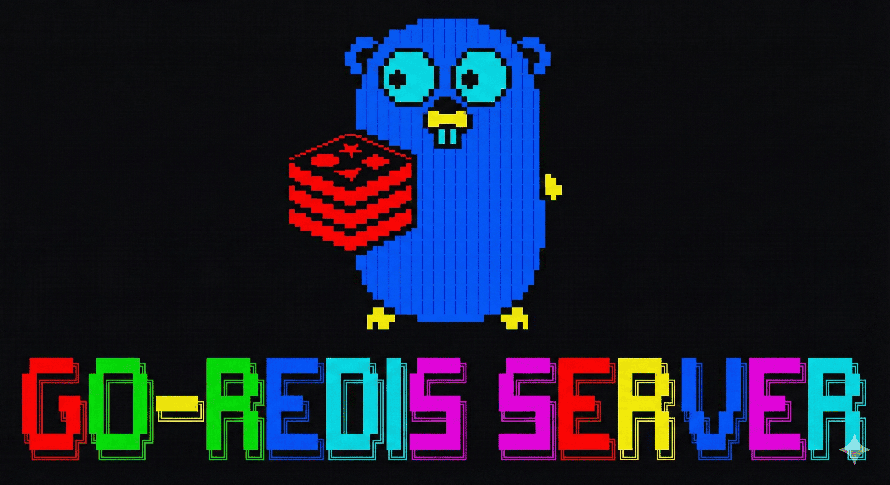

# Go-Redis: The Complete Guide (v0.1)

Welcome to the complete developer and user documentation for **Go-Redis**, a lightweight, multi-threaded, Redis-compatible server implemented in Go.

This document provides a deep dive into the project's features, architecture, and usage. Whether you are a developer looking to understand the internals, or a user wanting to get started, this guide is for you.

---

## Table of Contents

1.  [**Overview & Features**](#1-overview--features)
    -   [Design Goals](#design-goals)
2.  [**Getting Started**](#2-getting-started)
    -   [Prerequisites](#prerequisites)
    -   [Building from Source](#building-from-source)
    -   [Configuration](#configuration)
    -   [Running the Server](#running-the-server)
    -   [Connecting with `redis-cli`](#connecting-with-redis-cli)
3.  [**Docker Deployment**](#3-docker-deployment)
    -   [Using the Pre-built Image](#using-the-pre-built-image)
    -   [Building a Custom Image](#building-a-custom-image)
4.  [**Command Reference**](#4-command-reference)
    -   [String Operations](#string-operations)
    -   [Key Management](#key-management)
    -   [List Operations](#list-operations)
    -   [Set Operations](#set-operations)
    -   [Hash Operations](#hash-operations)
    -   [Sorted Set Operations](#sorted-set-operations)
    -   [Expiration Commands](#expiration-commands)
    -   [Transactions](#transactions)
    -   [Persistence Commands](#persistence-commands)
    -   [Server & Connection](#server--connection)
    -   [Monitoring & Information](#monitoring--information)
5.  [**Internal Architecture**](#5-internal-architecture)
    -   [High-Level Diagram](#high-level-diagram)
    -   [Project Structure & Core Components](#project-structure--core-components)
    -   [Concurrency Model](#concurrency-model)
    -   [Command Execution Pipeline](#command-execution-pipeline)
    -   [Data Model](#data-model)
    -   [RESP Protocol Support](#resp-protocol-support)
6.  [**Core Subsystems Explained**](#6-core-subsystems-explained)
    -   [Persistence: AOF vs. RDB](#persistence-aof-vs-rdb)
    -   [Memory Management & Eviction](#memory-management--eviction)
7.  [**Limitations**](#7-limitations)
8.  [**Contact & Support**](#8-contact--support)

---

## 1. Overview & Features

Go-Redis is a Redis-compatible in-memory key-value store server written in Go. It is designed to be a learning tool for understanding how a database like Redis works under the hood, while also being a functional server for development and testing purposes.

-   **Broad Command Support**: Implements a rich subset of commands for Strings, Lists, Sets, Hashes, and Sorted Sets.
-   **Dual Persistence Model**: 
    -   **AOF (Append-Only File)**: Logs every write operation with configurable `fsync` modes for high durability.
    -   **RDB (Redis Database)**: Creates point-in-time snapshots for fast startups and backups.
-   **Key Expiration**: Supports `EXPIRE`, `TTL`, and `PERSIST` with lazy (on-access) key removal.
-   **Atomic Transactions**: Group commands in `MULTI`/`EXEC` blocks for atomic execution.
-   **Server Security**: Built-in password authentication via the `AUTH` command.
-   **Introspection & Monitoring**: 
    -   `INFO` provides a detailed look into server statistics.
    -   `MONITOR` streams live command processing for debugging.
-   **Memory Management**: Allows setting a `maxmemory` limit and an eviction policy.
-   **RESP Compatible**: Fully compatible with the Redis Serialization Protocol (RESP), allowing `redis-cli` and other standard clients to connect seamlessly.
-   **Thread-Safe by Design**: Handles multiple concurrent clients safely using a single database protected by read-write locks.

### Design Goals

-   **Educational**: To provide a clear, readable, and well-documented codebase for those learning about database internals, concurrency in Go, and network programming.
-   **Redis-Compatible**: To work out-of-the-box with `redis-cli`.
-   **Correctness over Performance**: To prioritize a simple, correct, and deterministic implementation over complex performance optimizations.

---

## 2. Getting Started

### Prerequisites

-   **Go**: Version 1.24.4 or later.
-   **`redis-cli`**: The standard Redis command-line tool.
-   **OS**: Tested on Linux/Unix environments.

> **Note**: Before starting, ensure no other Redis instance is running on port `6379`. You can stop a default Redis service using `sudo systemctl stop redis-server`.

### Building from Source

Clone the repository and run the build command:
```bash
go build
```
This creates a `go-redis` executable in your project directory.

### Configuration

The server is configured using a `redis.conf` file. By default, it looks for `./config/redis.conf`.

**Example `redis.conf`:**
```conf
# Set the data directory for AOF and RDB files
dir ./data

# Enable AOF persistence and set fsync policy (always, everysec, no)
appendonly yes
appendfsync everysec

# Configure RDB snapshotting: save if 3 changes occur within 5 seconds
save 5 3
dbfilename backup.rdb

# Secure the server with a password
requirepass your-secret-password

# Set a 1GB memory limit and define eviction policy
maxmemory 1073741824
maxmemory-policy allkeys-random
```

### Running the Server

The server can be started with default paths or custom ones.

**Syntax:**
```bash
./go-redis [config_file_path] [data_directory_path]
```

-   **With defaults:**
    ```bash
    ./go-redis
    ```
-   **With custom paths:**
    ```bash
    ./go-redis ./my.conf ./my-data
    ```

The server will log its startup process and listen on port `6379`.

### Connecting with `redis-cli`

Open a new terminal and connect:
```bash
redis-cli -p 6379
```
If you've set `requirepass`, authenticate your session:
```
127.0.0.1:6379> AUTH your-secret-password
OK
```
You're all set to run commands!

---

## 3. Docker Deployment

### Using the Pre-built Image

The quickest way to run Go-Redis is with the official Docker image.

```bash
# 1. Pull the image from Docker Hub
docker pull akashmaji/go-redis:latest

# 2. Run the container, mounting a volume for persistent data
docker run -d -p 6379:6379 \
  -v $(pwd)/data:/app/data \
  akashmaji/go-redis:latest

# 3. Connect from your host
redis-cli
```

### Building a Custom Image

If you've modified the code, you can build your own image from the `Dockerfile`.

```bash
# 1. Build the image
docker build -t go-redis:latest .

# 2. Run the container
# This example mounts a custom config file and data directory
docker run -d -p 6379:6379 \
  -v $(pwd)/config/redis.conf:/app/config/redis.conf:ro \
  -v $(pwd)/data:/app/data \
  go-redis:latest
```

---

## 4. Command Reference

Below is a categorized list of all supported commands.

### String Operations
| Command | Description |
|---|---|
| `GET <key>` | Get the value of a key. |
| `SET <key> <value>` | Set the string value of a key. |
| `INCR <key>` | Increment the integer value of a key by one. |
| `DECR <key>` | Decrement the integer value of a key by one. |
| `INCRBY <key> <amount>`| Increment the integer value of a key by a given amount. |
| `DECRBY <key> <amount>`| Decrement the integer value of a key by a given amount. |
| `MGET <key> [key ...]` | Get the values of all the given keys. |
| `MSET <key> <value> ...` | Set multiple keys to multiple values. |

### Key Management
| Command | Description |
|---|---|
| `DEL <key> [key ...]` | Delete one or more keys. |
| `EXISTS <key>`| Check if a key exists. |
| `KEYS <pattern>` | Find all keys matching a pattern. **Warning: O(N) complexity.** |
| `RENAME <key> <newkey>`| Rename a key. |
| `TYPE <key>` | Get the type of value stored at a key. |
| `FLUSHDB`| Remove all keys from the database. **Warning: Irreversible.** |
| `DBSIZE`| Return the number of keys in the database. |

### List Operations
| Command | Description |
|---|---|
| `LPUSH <key> <value> ...` | Prepend one or more values to a list. |
| `RPUSH <key> <value> ...` | Append one or more values to a list. |
| `LPOP <key>` | Remove and get the first element in a list. |
| `RPOP <key>` | Remove and get the last element in a list. |
| `LRANGE <key> <start> <stop>`| Get a range of elements from a list. |
| `LLEN <key>` | Get the length of a list. |
| `LINDEX <key> <index>`| Get an element from a list by its index. |
| `LGET <key>` | **(Custom)** Get all elements in a list. |

### Set Operations
| Command | Description |
|---|---|
| `SADD <key> <member> ...` | Add one or more members to a set. |
| `SREM <key> <member> ...` | Remove one or more members from a set. |
| `SMEMBERS <key>`| Get all the members in a set. |
| `SISMEMBER <key> <member>`| Determine if a given value is a member of a set. |
| `SCARD <key>` | Get the number of members in a set. |

### Hash Operations
| Command | Description |
|---|---|
| `HSET <key> <field> <value>` | Set the string value of a hash field. |
| `HGET <key> <field>` | Get the value of a hash field. |
| `HDEL <key> <field> ...` | Delete one or more hash fields. |
| `HGETALL <key>`| Get all the fields and values in a hash. |
| `HINCRBY <key> <field> <inc>`| Increment the integer value of a hash field. |
| `HEXISTS <key> <field>`| Determine if a hash field exists. |
| `HLEN <key>` | Get the number of fields in a hash. |
| `HKEYS <key>` | Get all the fields in a hash. |
| `HVALS <key>` | Get all the values in a hash. |
| `HMSET <key> <field> <value> ...` | Set multiple hash fields to multiple values. |
| `HDELALL <key>`| **(Custom)** Delete the entire hash. |
| `HEXPIRE <key> <seconds>`| **(Custom)** Set a TTL on a hash key. |

### Sorted Set Operations
| Command | Description |
|---|---|
| `ZADD <key> <score> <member> ...` | Add members to a sorted set, or update scores. |
| `ZREM <key> <member> ...` | Remove members from a sorted set. |
| `ZSCORE <key> <member>`| Get the score of a member. |
| `ZCARD <key>` | Get the number of members in a sorted set. |
| `ZRANGE <key> <start> <stop> ...`| Return a range of members, by index. |
| `ZREVRANGE <key> <start> <stop> ...`| Return a range of members, by index, ordered high to low. |
| `ZGET <key> [member]` | **(Custom)** Get score of a member or all members. |

### Expiration Commands
| Command | Description |
|---|---|
| `EXPIRE <key> <seconds>`| Set a timeout on a key. |
| `TTL <key>` | Get the remaining time to live of a key. |
| `PERSIST <key>`| Remove the expiration from a key. |

### Transactions
| Command | Description |
|---|---|
| `MULTI` | Mark the start of a transaction block. |
| `EXEC` | Execute all commands queued in a transaction. |
| `DISCARD`| Discard all commands issued after `MULTI`. |

### Persistence Commands
| Command | Description |
|---|---|
| `SAVE` | **Synchronously** save the dataset to disk. **Blocks the server.** |
| `BGSAVE`| **Asynchronously** save the dataset to disk in the background. |
| `BGREWRITEAOF`| Asynchronously rewrite the append-only file. |

### Server & Connection
| Command | Description |
|---|---|
| `PING [message]` | Check the connection. |
| `AUTH <password>` | Authenticate to the server. |
| `COMMAND`| A simple command that returns `OK`. |
| `COMMANDS`| **(Custom)** List all available commands. |

### Monitoring & Information
| Command | Description |
|---|---|
| `INFO` | Get information and statistics about the server. |
| `MONITOR`| Listen for all requests received by the server in real-time. |

---

## 5. Internal Architecture

This section details the internal design of Go-Redis for developers and contributors.

### High-Level Diagram
```
   Client (redis-cli)
           |
          TCP
           |
     RESP Parser  (client.go)
           |
   Command Dispatcher (handlers.go)
           |
+--------------------------+
|   In-Memory Database     | (database.go)
|   map[string]*Value      |
| (RWMutex Protection)     |
+--------------------------+
           |
+--------------------------+
|   Persistence Layer      |
| - AOF (aof.go)           |
| - RDB (rdb.go)           |
+--------------------------+
```

### Project Structure & Core Components
```
go-redis/
├── main.go         # Server entrypoint, TCP listener
├── handlers.go     # Command handlers and dispatch logic
├── database.go     # Thread-safe in-memory database store
├── client.go       # Per-client connection handling and RESP parsing
├── value.go        # Data structure for stored values and metadata (TTL)
├── writer.go       # RESP protocol writer/encoder
├── conf.go         # Configuration loading from redis.conf
├── appstate.go     # Global server state management
├── aof.go          # Append-Only File (AOF) persistence logic
├── rdb.go          # Snapshot (RDB) persistence logic
├── mem.go          # Memory accounting and eviction logic
├── info.go         # Logic for the INFO command
├── config/
│   └── redis.conf  # Default configuration file
└── data/           # Default directory for persistence files
```

### Concurrency Model

-   **One Goroutine Per Client**: The server spawns a new goroutine for each incoming connection, ensuring clients are handled in parallel.
-   **Centralized Data Store**: A single, shared database instance is used for all clients.
-   **Read/Write Locking**: Access to the database is synchronized using `sync.RWMutex`: 
    -   **Read operations** (`GET`, `TTL`, etc.) use a read lock (`RLock`), allowing multiple readers to proceed concurrently.
    -   **Write operations** (`SET`, `DEL`, etc.) use a write lock (`Lock`), ensuring exclusive access and data consistency.

### Command Execution Pipeline

1.  A client connection is accepted, and a new goroutine starts handling it.
2.  The client's request is read from the TCP socket and parsed as a RESP message.
3.  The command and its arguments are dispatched to the appropriate handler function.
4.  If authentication is enabled, the client's authenticated status is checked.
5.  The handler acquires the necessary lock (read or write) on the database.
6.  The command logic is executed (e.g., reading/writing a value).
7.  A RESP-formatted response is written back to the client.
8.  For write commands, the operation is appended to the AOF buffer if enabled.

### Data Model

Each key in the database maps to a `Value` struct, which contains:
- The stored data itself (e.g., a string, list, or hash).
- An optional expiration timestamp (as a `time.Time`).
- Metadata for future eviction policies (e.g., access frequency).

### RESP Protocol Support

Go-Redis supports all primary RESP data types, making it fully compatible with `redis-cli`:
- `+` Simple Strings
- `-` Errors
- `:` Integers
- `$` Bulk Strings
- `*` Arrays
- `$-1` Nulls

---

## 6. Core Subsystems Explained

### Persistence: AOF vs. RDB

| Feature | AOF (Append-Only File) | RDB (Snapshot) |
|---|---|---|
| **Strategy** | Logs every write command to a file. | Saves a point-in-time snapshot of the entire dataset. |
| **Pros** | - Higher durability. <br> - More granular (can lose at most 1s of data with `everysec`). | - Faster restarts (loads one big file). <br> - Compact file size. |
| **Cons** | - Larger file size. <br> - Slower restarts on large datasets. | - Less durable (can lose data since last snapshot). |
| **Use Case** | Maximum data safety. | Fast backups and disaster recovery. |

-   **AOF `fsync` Policies**: Controlled by `appendfsync` in `redis.conf`.
    -   `always`: Safest but slowest. `fsync()` on every write.
    -   `everysec`: Default. `fsync()` once per second. Good trade-off.
    -   `no`: Fastest. Lets the OS decide when to `fsync()`.
-   **RDB Triggers**: Controlled by `save` rules in `redis.conf` or manually via `SAVE`/`BGSAVE`.

### Memory Management & Eviction

-   **`maxmemory`**: This directive in `redis.conf` sets a hard limit on the memory Go-Redis can use.
-   **`maxmemory-policy`**: When the `maxmemory` limit is reached, this policy determines the eviction behavior.
    -   `no-eviction`: (Default) Blocks write commands that would exceed the limit, returning an error.
    -   `allkeys-random`: Randomly evicts keys to make space for new data.

---

## 7. Limitations

Go-Redis is an educational project and intentionally omits certain advanced Redis features:

-   Single database only (no `SELECT` command).
-   No replication or clustering.
-   No Pub/Sub messaging.
-   No Lua scripting.
-   No `WATCH` command for optimistic locking in transactions.
-   Eviction policies are limited (`allkeys-lru`, `allkeys-lfu` are not implemented).

---

## 8. Contact & Support

For bug reports, questions, or contributions, please contact:
-   **Author**: Akash Maji
-   **Email**: `akashmaji@iisc.ac.in`